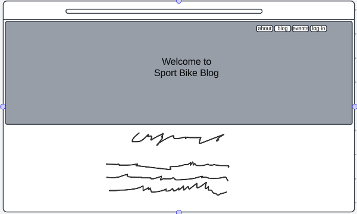
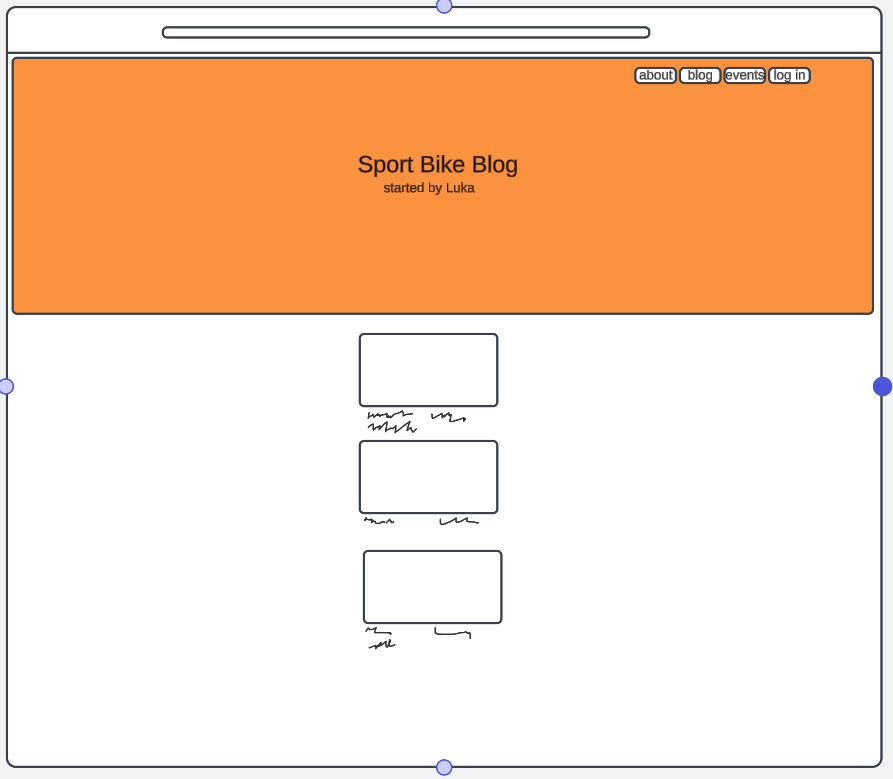
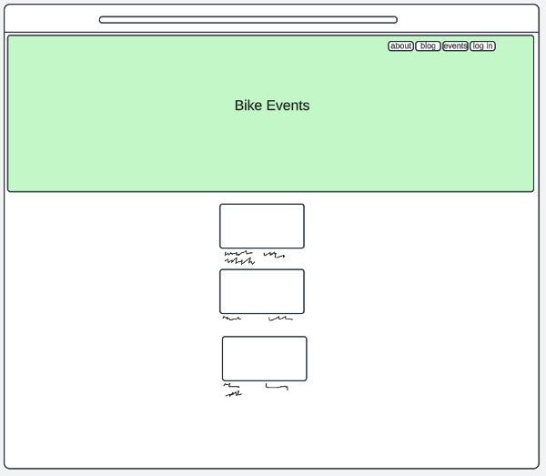
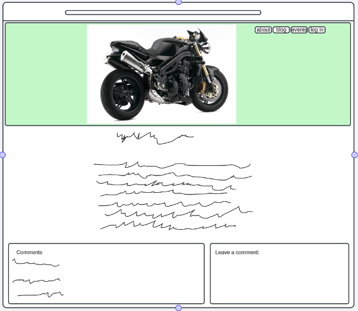
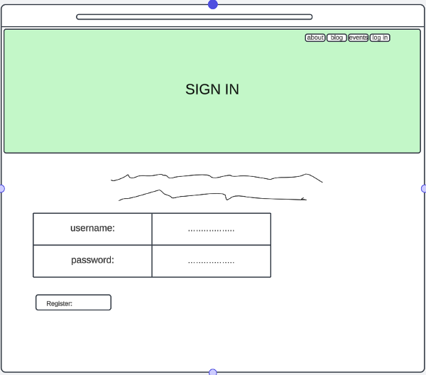
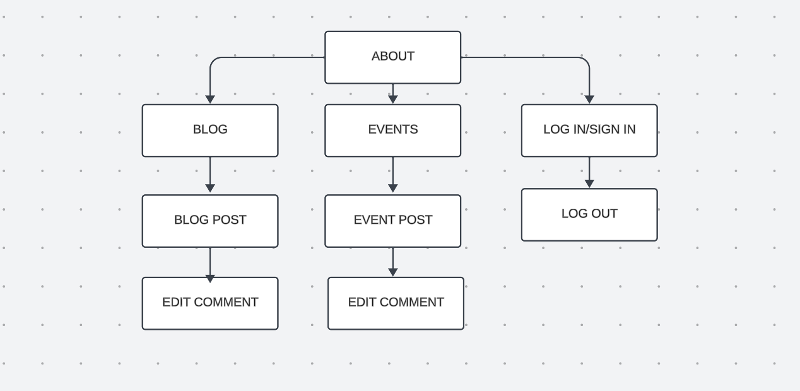
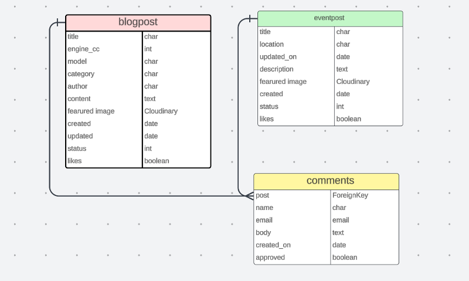

# SPORT BIKE BLOG

"Sport Bike Blog is your ultimate destination for the latest news, reviews, and insights into the exhilarating world of sport bikes. Whether you're a seasoned rider or a passionate enthusiast, our blog covers everything from cutting-edge motorcycle technology and performance reviews to thrilling ride experiences and must-have gear. Join us as we explore the fast-paced and dynamic realm of sport bikes, sharing tips, trends, and stories that ignite the passion for two-wheeled adrenaline."


The live link for "Sport Bike Blog" can be found [HERE](https://sport-bike-blog-416f164a9499.herokuapp.com/)

## Table of Contents
+ [User Stories](#user-stories)
+ [Design](#design)
  + [Wireframes](#wireframes)
  + [Database Scheme](#database-scheme)
  + [Color Scheme](#color-palette)
+ [Features](#features)
  + [CRUD](#crud)
+ [Testing](#testing)
+ [Technologies used](#technologies-used)
  + [Main Languages Used](#main-languages-used)
  + [Libraries, Frameworks and Programs](#libraries-frameworks-and-programs)
  + [Installed Packages](#installed-packages)
+ [Deployment](#deployment)
+ [Credits](#credits)

## User Stories

On this site, beside Admin, Site Visitors can sign up, log in and become Site Users.

### Admin Stories

1. As an Admin I can create posts so that I can manage my app posts.

2. As an Admin I can moderate blog comments so that the feedback provided is appropriate.

### User Stories

1. As a Site User I can register account so that I can comment on posts

2. As a Site User I can open posts so that I can read full post text.

3. As a Site User I can read comments so that I can get additional information.

4. As a Site User I can write comments so that I can give my feedback on post.

5. As a Site User I can update comments so that I can get additional information.

6. As a Site User I can delete comments.

7. As a Site User I can like/unlike posts so that I can share my opinion on a post.

### Visitor Stories

1. As a Site Visitor I can open posts so that I can read full post text.

2. As a Site Visitor I can read comments so that I can get additional information.


## Design

### Wireframes

Home page


Blog Page


Events Page


Post Page


Sign In/Log In Page

#### Site Navigation



### Database Scheme



### Color Palette


## Features

#### About Page


#### Blog Page


#### Events Page


#### Log In, Sign In Page


### CRUD

CRUD function is avaliable in comments sections for registered and inlogged users.

All users can read blog and events posts and comments beneath them and see number of likes.


Only registered and inlogged users can EDIT and DELETE their comments only and LIKE or UNLIKE posts.


## Testing

- .html files pass through the [W3C validator](https://validator.w3.org) with no issues
  
- CSS files pass through the [Jigsaw validator](https://jigsaw.w3.org/css-validator/)


- page has good Accessibility rating in Lighthouse


- Python files tested in [CI Python Linter](https://pep8ci.herokuapp.com/) with no issues
  
- All social links opens to external links as intended.


## Technologies Used

### Main Languages Used

- HTML5
- CSS3
- JavaScript
- Python
- Django
- SQL Postgres

### Libraries, Frameworks and Programs

- CodeAnywhere - IDE to create my html files & styling sheet before pushing the project to Github.
- GitHub - to store my repository.
- Django
- Bootstrap
- Google Fonts - font families.
- Font Awesome - to add icons to the social links in the footer element.
- Favicon
- Am I Responsive? - to ensure the project looked good across all devices.
- LucidChart

### Installed Packages

- 'django' gunicorn
- dj_database_url psycopg2
- dj3-cloudinary-storage
- django-summernote [(link)](https://summernote.org/)
- django-allauth [(link)](https://django-allauth.readthedocs.io/en/latest/)
- django-crispy-forms[(link)](https://django-crispy-forms.readthedocs.io/en/latest/index.html)

## Deployment

Sport Bike Blog site was deployed to Heroku following next steps:

- Install Django & Gunicorn:
```pip3 install 'django' gunicorn```
- Install Django database & psycopg:
```pip3 install dj_database_url psycopg2```
- Install Cloudinary:
```pip3 install dj3-cloudinary-storage```
- Creating the requirements.txt file with the following command:
```pip3 freeze --local > requirements.txt```
- a django project was created using:
```django-admin startproject sportbike .```
- the blog app was then created with:
```python3 manage.py startapp blog```
- which was then added to the settings.py file within our project directory.
- the changes were then migrated using:
```python3 manage.py migrate```
- navigated to [Heroku](www.heroku.com) & created a new app called sport-bike-blog.
- added the Heroku Postgres database to the Resources tab.
- navigated to the Settings Tab, to add the following key/value pairs to the configvars:

1. key: SECRET_KEY | value: randomkey
2. key: PORT | value: 8000
3. key: CLOUDINARY_URL | value: API environment variable
4. key: DATABASE_URL | value: value supplied by Heroku

- added the DATABASE_URL, SECRET_KEY & CLOUDINARY_URL to the env.py file
- added the DATABASE_URL, SECRET_KEY & CLOUDINARY_URL to the settings.py file
- add an import os statement for the env.py file.
- added Heroku to the ALLOWED_HOSTS in settings.py
- created the Procfile
- pushed the project to Github
- connected my github account to Heroku through the Deploy tab
- connected my github project repository, and then clicked on the "Deploy" button

## Credits

- [Lauren-Nicole Popich](https://github.com/CluelessBiker): a MENTOR!
- Tutor Support
- "I think therefore I blog", "Hello Django"
- [Start Bootstrap](<https://startbootstrap.com/theme/clean-blog>) base for blog site
- Slack

+ [Stackoverflow](https://stackoverflow.com/questions/66185424/django-how-do-i-handle-urls-with-multiple-apps) - how to connect URL paths from multiple apps
- Sean from Tutor Support with help and explaining how to make EDIT and DELETE buttons work
